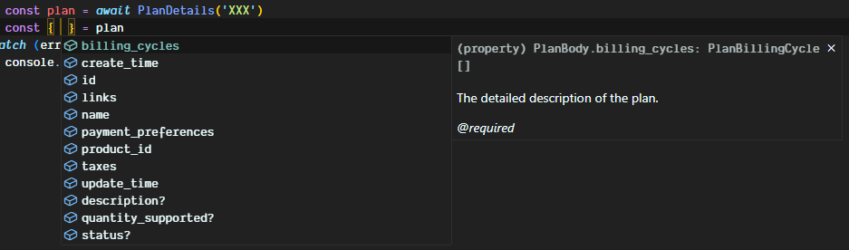

<br />
<h3 align="center">
  PayPal JavaScript SDK that supports all PayPal REST APIs out of the box.
</h3>
<br />

## Features

-   🗂 **Typed**: Include 100% detailed types for everything you will ever need, [types included](#types-included).
-   🌳 **Tree-shakeable**: Only the parts you use will be imported into your app's bundle.
-   🚀 **Fast**: Built with ES6 modules and functions.
-   🛡 **Bulletproof**: Written in strict TypeScript and has 100% test coverage.
-   😍 **Simple**: Straightforward and easy to use, covers multiple ways to achive your tasks and keep your code clean.
-   🤞 **V1 & V2**: Includes support for both V1 and V2 of the PayPal REST APIs out of the box.
-   📖 **Documentation**: Includes detailed documentation for all the APIs and functions.
-   ✨ **Validations**: Includes validation for all the APIs and functions, powered by [Zod](https://zod.dev).
-   📦 **Modular**: Includes support for all the PayPal REST APIs, you can import only the parts you need into your app's bundle, this will reduce the bundle size and improve performance.
-   ⛏️ **Error Handling**: Includes support for error handling, you can catch errors and handle them in your app.

## Table of Contents

-   [Preparations](#preparations)
-   [Getting Started](#getting-started)
-   [Moving Into Production](#moving-into-production)
-   [Types Included](#types-included)
-   [Contribution](#contribution)

## Tutorials

-   [Create a Payment Request](#create-a-payment-request)
-   [Create Subscription Link](#create-subscription-link)

## Available APIs

| API                                                                 | Description                                                                                                                                                               | Progress |
| ------------------------------------------------------------------- | ------------------------------------------------------------------------------------------------------------------------------------------------------------------------- | -------- |
| [Shipment Tracking](#shipment-tracking)                             | Manage tracking information on your PayPal transactions                                                                                                                   | 100%     |
| [Catalog Products](#catalog-products)                               | Create products, which are goods and services, to then use as product offerings in subscriptions.                                                                         | 100%     |
| [Disputes](#disputes)                                               | Manage customer initiated disputes, chargebacks, or bank reversals.                                                                                                       | 0%       |
| [Identity](#identity)                                               | Get user profile information and manage user account settings.                                                                                                            | 0%       |
| [Invoices](#invoices)                                               | Create, send, and manage invoices, including tracking invoice payments.                                                                                                   | 0%       |
| [Orders](#orders)                                                   | Create, update, retrieve, authorize, and capture orders.                                                                                                                  | 100%     |
| [Partner Referrals](#partner-referrals)                             | Add PayPal seller accounts to your platform to connect your seller with PayPal before they accept a buyer payment.                                                        | 0%       |
| [Payment Experience Web Profiles](#payment-experience-web-profiles) | Create web experience profiles to customize payment flow experiences from cart to buyer payment.                                                                          | 0%       |
| [Payment Method Tokens](#payment-method-tokens)                     | The Payment Method Tokens API saves payment methods so payers don't have to enter details for future transactions.                                                        | 0%       |
| [Payments](#payments)                                               | Use in conjunction with the Orders API to authorize payments, capture authorized payments, refund payments that have already been captured, and show payment information. | 100%     |
| [Payouts](#payouts)                                                 | Make payments or send commissions, rebates, rewards, and general disbursements to multiple PayPal or Venmo recipients.                                                    | 0%       |
| [Referenced Payouts](#referenced-payouts)                           | Disburse held funds captured in a delayed payment from a buyer to your seller.                                                                                            | 0%       |
| [Subscriptions](#subscriptions)                                     | Create subscriptions that process recurring PayPal payments for physical or digital goods, or services.                                                                   | 100%     |
| [Transaction Search](#transaction-search)                           | Get the transaction history for a PayPal account.                                                                                                                         | 0%       |
| [Webhooks Management](#webhooks-management)                         | Subscribe to and manage your application's webhook events.                                                                                                                | 100%     |

## Preparations

Install the package using your favorite package manager:

```
npm install paypal-jsdk
```

```
pnpm add paypal-jsdk
```

```
yarn add paypal-jsdk
```

Create a PayPal Developer Client & Authenticate with PayPal

1. Create a 2 sandbox accounts on [PayPal Developer Dashboard](https://developer.paypal.com/dashboard/accounts)
   One for the seller (business) and one for the buyer (personal)
2. Login to the sandbox account in the [PayPal Sandbox Portal](https://www.sandbox.paypal.com/billing/plans)
3. Create an app in the [My Apps & Credentials](https://developer.paypal.com/developer/applications/) section
   One Sandbox and one Live app, for the Sandbox select the business account
    - The Live app will be used for production
    - The Sandbox app will be used for testing
4. Select the features that you need, make sure that the Subscriptions feature is enabled in order to use the Subscriptions API.
5. Copy the client id and secret from the sandbox app and paste them in the .env file
6. For localhost testing you can use [ngrok](https://ngrok.com/) to create a tunnel to your localhost

-   For the Subscriptions API follow these steps:

1. Head over to the Sandbox Webhooks section at the bottom of the page and create a new webhook
    - The webhook url should be the url of your app + something like /api/paypal/webhooks
    - Choose these events: `Billing subscription activated, Billing subscription expired, Billing subscription payment failed, Billing subscription re-activated, Payment sale completed`

## Getting Started

The package is built with ES6 modules and functions, so you can import only the parts you need into your app's bundle, this will reduce the bundle size and improve performance.

In order to get started and init the paypal client you have 2 options:

1. add these variables to your .env file:

```env
PAYPAL_CLIENT_ID = "XXX"
PAYPAL_CLIENT_SECRET = "XXX"
PAYPAL_MODE = "SANDBOX" # or LIVE
```

2. Initialize the client manually:

```js
import Paypal from 'paypal-jsdk'

await Paypal.init('clietId', 'clientSecret', 'SANDBOX')

const Router = (req, res) => {
	// Your router logic
}
```

Note that you can also import the package functions directly:

```js
import { Init } from 'paypal-jsdk'

await Init('clietId', 'clientSecret', 'SANDBOX') // or LIVE

const Router = (req, res) => {
	// Your router logic
}
```

# Tutorials

## Create a Payment Request

-   todo

## Create Subscription Link

> Create any type of subscription using the Subscriptions API, in this tutorial we will create a catalog product, subscription plan with a monthly billing cycle and get a subscription link.

1. Create a product for the subscription plan, you can either do that from the [PayPal Dashboard](https://www.sandbox.paypal.com/billing/overview) or from the server.
   note that you will need to create the product in both the [sandbox dashboard](https://www.sandbox.paypal.com/billing/overview) and the [live dashboard](https://www.paypal.com/billing/overview) in order to move into production.

2. Create a plan for the subscription

```ts
import { Init } from 'paypal-jsdk'
import { Products, Plans, Subscriptions } from 'paypal-jsdk'

await Init('clietId', 'clientSecret', 'SANDBOX')

// POST /your-api/subscription
const Router = (req, res) => {
	// ...

	// 1. Create a product and get the id
	const { id: product_id } = await Products.create({
		id: '123456789',
		name: 'Test Product',
		type: 'DIGITAL',
	})

	/// 2. Create a plan and get the id
	const { id: plan_id } = await Plans.create({
		product_id,
		name: 'Monthly Plan',
		description: 'Monthly Cycle Plan',
		billing_cycles: [
			{
				frequency: {
					interval_unit: 'MONTH',
					interval_count: 1,
				},
				tenure_type: 'REGULAR',
				sequence: 1,
				pricing_scheme: {
					fixed_price: {
						value: '10.00',
						currency_code: 'USD',
					},
				},
			},
		],
		payment_preferences: {
			setup_fee_failure_action: 'CANCEL',
		},
	})
}
```

3. Create a subscription and get the payment url

```ts
// GET /your-api/subscription
const Router = (req, res) => {
	// ...

	// 3. Create a subscription and get the payment url
	const { paymentUrl } = await Subscriptions.create(product_id)
	return paymentUrl
	// ...
}
```

> you can also create the plan through the [Sandbox PayPal Developer Portal](https://www.sandbox.paypal.com/billing/plans), or through the [Live PayPal Developer Portal](https://www.paypal.com/billing/plans).

# Available APIs

### Shipment Tracking

> Manage tracking information on your PayPal transactions

#### Add tracking information

> Adds tracking information for a PayPal transaction.

```ts
import { Tracking } from 'paypal-jsdk'

const example: Tracker = {
	transaction_id: 'XXX',
	notify_buyer: true,
	shipment_direction: 'FORWARD',
	status: 'SHIPPED',
}

await Tracking.add([example])
```

#### Edit tracking information

> Update or cancel tracking information for PayPal transaction

```ts
import { Tracking } from 'paypal-jsdk'

const options = {
	transaction_id: 'XXX',
	notify_buyer: true,
	shipment_direction: 'FORWARD',
	status: 'SHIPPED',
}
await Tracking.edit('tracker_id', options)
```

#### Show tracking information

> Shows tracking information, by tracker ID, for a PayPal transaction.

```ts
import { Tracking } from 'paypal-jsdk'

const information = await Tracking.information('XXX')
```

for more information about the Payments API check the [official documentation](https://developer.paypal.com/docs/api/tracking/v1/)

### Catalog Products

> Create products, which are goods and services, to then use as product offerings in subscriptions.

#### Create a product

> Creates a product.

```ts
import { Products } from 'paypal-jsdk'

const product = await Products.create({
	id: '123456789',
	name: 'Test Product',
	type: 'DIGITAL',
})
```

#### List products

> Lists products.

```ts
import { Products } from 'paypal-jsdk'

const products = await Products.list({
	page: 1,
	page_size: 1,
	total_required: true,
})
```

#### Show product details

> Shows details for a product, by ID.

```ts
import { Products } from 'paypal-jsdk'

const product = await Products.details('P-XXX')
```

for more information about the Orders API check the [official documentation](https://developer.paypal.com/docs/api/catalog-products/v1)

### Disputes

-   not available yet

### Identity

-   not available yet

### Invoices

-   not available yet

### Orders

> Create, update, retrieve, authorize, and capture orders.

#### Add tracking information

> Adds tracking information for an order.

```ts
import { Orders } from 'paypal-jsdk'

const order = await Orders.addTracking('XXX', {
	capture_id: 'XXX',
	tracking_number: 'XXX',
	carrier: 'FEDEX',
})
```

#### Authorize an order

> Authorizes payment for an order.

```ts
import { Orders } from 'paypal-jsdk'

const order = await Orders.authorizePayment('XXX')
```

#### Capture an order

> Captures payment for an order.

```ts
import { Orders } from 'paypal-jsdk'

const order = await Orders.capturePayment('XXX')
```

#### Confirm an order

> Payer confirms their intent to pay for the the Order with the given payment source.

```ts
import { Orders } from 'paypal-jsdk'

const order = await Orders.confirm('XXX', {
	payment_source: {
		paypal: {
			email_address: 'XXX',
		},
	},
})
```

#### Create an order

> Creates an order. Merchants and partners can add Level 2 and 3 data to payments to reduce risk and payment processing costs.

```ts
import { Orders } from 'paypal-jsdk'

const order = await Orders.create({
	intent: 'CAPTURE',
	purchase_units: [
		{
			amount: {
				currency_code: 'USD',
				value: '10.00',
				breakdown: {
					item_total: {
						currency_code: 'USD',
						value: '10.00',
					},
				},
			},
			items: [
				{
					name: 'Test Item',
					quantity: '1',
					unit_amount: {
						currency_code: 'USD',
						value: '10.00',
					},
					category: 'DIGITAL_GOODS',
				},
			],
		},
	],
})
```

#### Show order details

> Shows details for an order, by ID.

```ts
import { Orders } from 'paypal-jsdk'

const order = await Orders.showDetails('XXX')
```

for more information about the Orders API check the [official documentation](https://developer.paypal.com/docs/api/orders/v2/)

### Partner Referrals

-   not available yet

### Payment Experience Web Profiles

-   not available yet

### Payment Method Tokens

-   not available yet

### Payments

> Call the Payments API to authorize payments, capture authorized payments, refund payments that have already been captured, and show payment information. Use the Payments API in conjunction with the Orders API. For more information, see the PayPal Checkout Overview.

#### Show authorized payment details

> Shows details for an authorized payment, by ID.

```ts
import { Payments } from 'paypal-jsdk'

const payments = await Payments.details('XXX')
```

#### Show captured payment details

> Shows details for a captured payment, by ID.

```ts
import { Payments } from 'paypal-jsdk'

const payments = await Payments.capturedDetails('XXX')
```

#### Capture authorized payment

> Captures an authorized payment, by ID.

```ts
import { Payments } from 'paypal-jsdk'

const authorizedPayment = await Payments.capture('XXX', {
	amount: {
		currency_code: 'USD',
		value: '100.00',
	},
	final_capture: true,
})
```

#### Void authorized payment

> Voids, or cancels, an authorized payment, by ID. You cannot void an authorized payment that has been fully captured.

```ts
import { Payments } from 'paypal-jsdk'

await Payments.cancel('XXX')
```

#### Reauthorize authorized payment

> Reauthorize authorized payment

```ts
import { Payments } from 'paypal-jsdk'

const reauthorizedPayment = await Payments.reauthorize('XXX', {
	currency_code: 'USD',
	value: '100.00',
})
```

#### Refund captured payment

> Refunds a captured payment, by ID.
> For a full refund, include an empty payload in the JSON request body.
> For a partial refund, include an `amount` object in the JSON request body.

```ts
import { Payments } from 'paypal-jsdk'

const refundDetails = await Payments.refundCaptured('XXX')
```

#### Shows details for a refund, by ID.

> Shows details for a refund, by ID.

```ts
import { Payments } from 'paypal-jsdk'

const refundDetails = await Payments.refundDetails('XXX')
```

for more information about the Payments API check the [official documentation](https://developer.paypal.com/docs/api/payments/v2/)

### Payouts

-   not available yet

### Referenced Payouts

-   not available yet

### Subscriptions

> You can use billing plans and subscriptions to create subscriptions that process recurring PayPal payments for physical or digital goods, or services. A plan includes pricing and billing cycle information that defines the amount and frequency of charge for a subscription. You can also define a fixed plan, such as a $5 basic plan or a volume- or graduated-based plan with pricing tiers based on the quantity purchased. For more information, see Subscriptions Overview.

#### Create a Plan

> Creates a plan that defines pricing and billing cycle details for subscriptions.

```ts
import { Plans } from 'paypal-jsdk'

const newPlan = await Plans.create({
	product_id: 'PROD-XXX',
	name: 'Test Plan',
	description: 'Test Plan',
	billing_cycles: [
		{
			frequency: {
				interval_unit: 'MONTH',
				interval_count: 1,
			},
			tenure_type: 'REGULAR',
			sequence: 1,
			pricing_scheme: {
				fixed_price: {
					value: '10.00',
					currency_code: 'USD',
				},
			},
		},
	],
	payment_preferences: {
		setup_fee_failure_action: 'CANCEL',
	},
})
```

#### List plans

> Lists billing plans.

```ts
import { Plans } from 'paypal-jsdk'

const plans = await Plans.list({
	page_size: 10,
	page: 1,
	total_required: true,
})
```

#### Show plan details

> Shows details for a plan, by ID.

```ts
import { Plans } from 'paypal-jsdk'

const details = await Plans.details('P-XXX')
```

#### Activate plan

> Activates a plan, by ID.

```ts
import { Plans } from 'paypal-jsdk'

await Plans.activate('P-XXX')
```

#### Deactivate plan

> Deactivates a plan, by ID.

```ts
import { Plans } from 'paypal-jsdk'

await Plans.deactivate('P-XXX')
```

#### Update pricing

> Updates pricing for a plan. For example, you can update a regular billing cycle from $5 per month to $7 per month.

```ts
import { Plans } from 'paypal-jsdk'

await Plans.updatePricing('P-4LD7587879155310YMTUM7PA', [
	{
		billing_cycle_sequence: 1,
		pricing_scheme: {
			fixed_price: {
				value: '14.00',
				currency_code: 'USD',
			},
		},
	},
])
```

#### Create subscription

> Creates a subscription.

```ts
import { Subscriptions } from 'paypal-jsdk'

const { paymentUrl } = await Subscriptions.create('P-XXXX')
```

#### Show subscription details

> Shows details for a subscription, by ID.

```ts
import { Subscriptions } from 'paypal-jsdk'

const details = await Subscriptions.showDetails('I-XXX')
```

#### Revise plan or quantity of subscription

> Updates the quantity of the product or service in a subscription. You can also use this method to switch the plan and update the shipping_amount, shipping_address values for the subscription. This type of update requires the buyer's consent.

```ts
import { Subscriptions } from 'paypal-jsdk'

await Subscriptions.revisePlan('P-4LD7587879155310YMTUM7PA', {
	...options,
})
```

#### Suspend subscription

> Suspends the subscription.

```ts
import { Subscriptions } from 'paypal-jsdk'

await Subscriptions.suspend('P-XXX', 'Reason...')
```

#### Cancel subscription

> Cancels the subscription.

```ts
import { Subscriptions } from 'paypal-jsdk'

await Subscriptions.cancel('P-XXX', 'Reason...')
```

#### Activate subscription

> Activates the subscription.

```ts
import { Subscriptions } from 'paypal-jsdk'

await Subscriptions.activate('P-XXX')
```

#### Capture authorized payment on subscription

> Captures an authorized payment from the subscriber on the subscription.

```ts
import { Subscriptions } from 'paypal-jsdk'

await Subscriptions.capturePayment('I-K8P5B0NSA6N6', {
	amount: {
		currency_code: 'USD',
		value: '10.00',
	},
	capture_type: 'OUTSTANDING_BALANCE',
	notes: 'Payment for outstanding balance.',
})
```

#### List transactions for subscription

> Lists transactions for a subscription.

```ts
import { Subscriptions } from 'paypal-jsdk'

await Subscriptions.listTransactions('I-K8P5B0NSA6N6', {
	start_time: '2021-09-01T00:00:00Z',
	end_time: '2021-09-30T00:00:00Z',
})
```

for more information about the Subscriptions API check the [official documentation](https://developer.paypal.com/docs/api/subscriptions/v1/)

### Transaction Search

-   not available yet

### Webhooks Management

> Subscribe to and manage your application's webhook events.

#### List transactions for subscription

> Subscribes your webhook listener to events.

```ts
import { Webhooks } from 'paypal-jsdk'

const webhook = await Webhooks.create('https://example.com', ['BILLING.SUBSCRIPTION.CREATED'])
```

#### Create webhook lookup

> Creates a webhook lookup.

```ts
import { Webhooks } from 'paypal-jsdk'

const lookup = await Webhooks.createLookup()
```

#### Delete webhook

> Deletes a webhook, by ID.

```ts
import { Webhooks } from 'paypal-jsdk'

await Webhooks.delete('XXX')
```

#### Delete webhook lookup

> Deletes a webhook lookup, by ID.

```ts
import { Webhooks } from 'paypal-jsdk'

await Webhooks.deleteLookup('XXX')
```

#### Show webhook event notification details

> Shows details for a webhooks event notification, by ID.

```ts
import { Webhooks } from 'paypal-jsdk'

const eventNotifications = await Webooks.showEventNotificationDetails('WH-XXX')
```

#### List webhooks

> Lists webhooks for an app.

```ts
import { Webhooks } from 'paypal-jsdk'

const webhooks = await Webhooks.list()
```

#### List event notifications

> Lists webhooks event notifications.

```ts
import { Webhooks } from 'paypal-jsdk'

const eventNotifications = await Webhooks.listEventNotifications()
```

#### List available events

> Lists available events to which any webhook can subscribe.

```ts
import { Webhooks } from 'paypal-jsdk'

const events = await Webhooks.listAvailableEvents()
```

#### List webhook lookups

> Lists all webhook lookups.

```ts
import { Webhooks } from 'paypal-jsdk'

const lookups = await Webhooks.listLookups()
```

#### List webhook lookups

> Lists all webhook lookups.

```ts
import { Webhooks } from 'paypal-jsdk'

const lookups = await Webhooks.listLookups()
```

#### List webhook lookups

> Lists all webhook lookups.

```ts
import { Webhooks } from 'paypal-jsdk'

const events = await Webhooks.listEvents('8PT59735JN779430N')
```

#### Show webhook lookup details

> Shows details for a webhook lookup, by ID.

```ts
import { Webhooks } from 'paypal-jsdk'

const lookup = await Webhooks.lookupDetails('8PT59735JN779430N')
```

#### Resend webhook event notification

> Resends a webhook event notification, by ID.

```ts
import { Webhooks } from 'paypal-jsdk'

const eventNotifications = await Webhooks.resendEventNotification('WH-XXX', ['8PT59735JN779430N'])
```

#### Show detals

> Shows details for a webhook, by ID.

```ts
import { Webhooks } from 'paypal-jsdk'

const webhook = await Webhooks.showDetails('8PT59735JN779430N')
```

#### Simulate webhook event

> Simulates a webhook event. In the JSON request body, specify a sample payload.

```ts
import { Webhooks } from 'paypal-jsdk'

const eventNotifications = await Webhooks.simulateEvent({
	event_type: 'PAYMENT.CAPTURE.COMPLETED',
})
```

#### Verify webhook signature

> Verifies a webhook signature.

```ts
import { Webhooks } from 'paypal-jsdk'

await Webhooks.verifySignature({
	auth_algo: req.headers['paypal-auth-algo'],
	cert_url: req.headers['paypal-cert-url'],
	transmission_id: req.headers['paypal-transmission-id'],
	transmission_sig: req.headers['paypal-transmission-sig'],
	transmission_time: req.headers['paypal-transmission-time'],
	webhook_id: '8PT59735JN779430N',
	webhook_event: req.body,
})
```

for more information about the Webhooks API check the [official documentation](https://developer.paypal.com/docs/api/webhooks/v1/)

## Utilities

> The package includes some utilities that you can use in your app.

#### Get App Access Token

> Get an access token for your app.

```ts
import { GetPayPalAccessToken } from 'paypal-jsdk'

const token = await GetPayPalAccessToken()
```

#### Get PayPal Client

> Get the PayPal for v1/v2 versions, it will also generate a token for every request.

```ts
import { PaypalV1, PaypalV2 } from 'paypal-jsdk'

// Send a custom get request with the v1 API
const request = await PaypalV1.get('/...')

// Send a custom post request with the v2 API
const request = await PaypalV2.post('/...', { ... })
```

# Moving Into Production

Change the mode to LIVE in your .env file (`process.env.PAYPAL_MODE = "LIVE"`) and use the live client id and secret from the [PayPal Developer Dashboard](https://developer.paypal.com/dashboard/applications).

Thats it!

## Types Included

The package includes typescript support out of the box and detailed types for all the PayPal REST APIs requests and responses.


todo
You can also import the types directly:

```ts
import type { CreatedPlan } from 'paypal-jsdk'
import { Plans } from 'paypal-jsdk'

const newPlan: CreatedPlan = await Plans.create({
	product_id: 'PROD-XXX',
	name: 'Test Plan',
	description: 'Test Plan',
	// ...
})
```

## Contribution

Note that the package is still in development, we are working on adding more APIs and features.
if you want to contribute to the project you can do so by opening a pull request or an issue.

```

```
